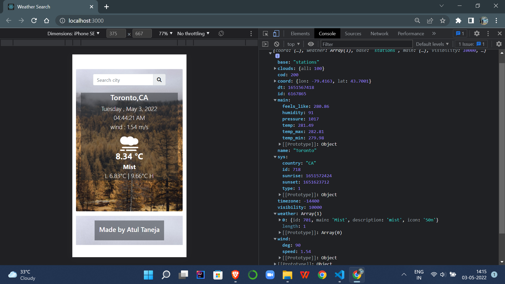
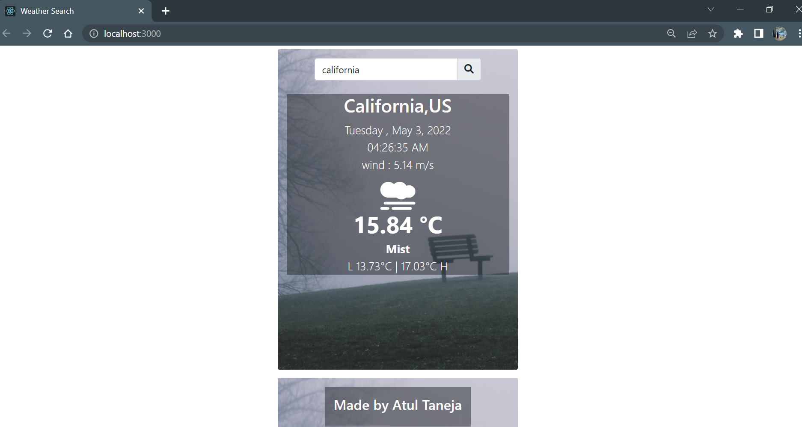
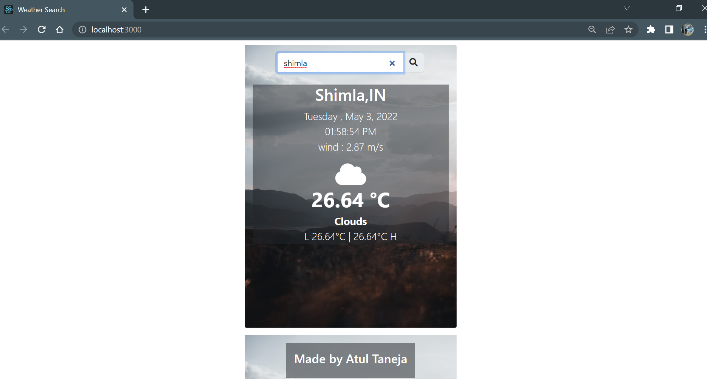

## Developed a weather-app in ReactJS

This app is created using **API** found on https://openweathermap.org/api 
<ul>
<li>When a user inputs the city name and gets the current temperature with specific icon and specific background.</li>
<li>The UI also displays the date/time for the specific city that is being searched, not local time</li>
<li>API Fetches city name, country code ,wind in m/s , current temperature in celcius ,highest and lowest temperautre of the day</li>
</ul>

### Sample response of API

### Results

### Desktop view

 

### Mobile view

### Link to view Deployment

[Project Link](https://atultnj21.github.io/weather-app/)