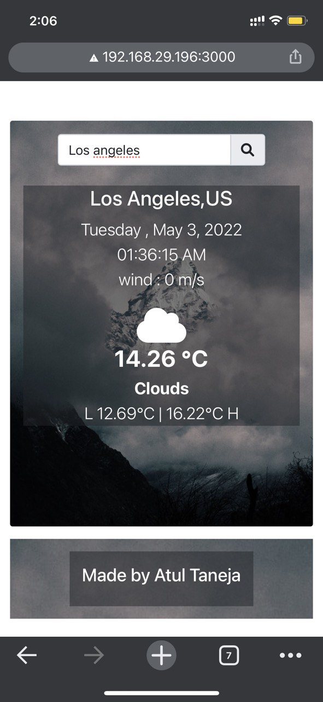

## Developed a weather-app in ReactJS

This app is created using **API** found on https://openweathermap.org/api 
<ul>
<li>When a user inputs the city name he gets the <b>current temperature</b> with <b>specific icon</b> and <b>specific background</b>.</li>
<li>The UI also displays the date/time for the <b>specific city</b> that is being searched, <b>not local time</b></li>
<li>API Fetches <b>city name, country code ,wind in m/s , current temperature in celcius ,highest and lowest temperautre</b> of the day</li>
</ul>

### Sample response of API

### Results

### Desktop view

 

### Mobile view

### Link to view Deployment

[Project Link](https://atultnj21.github.io/weather-app/)